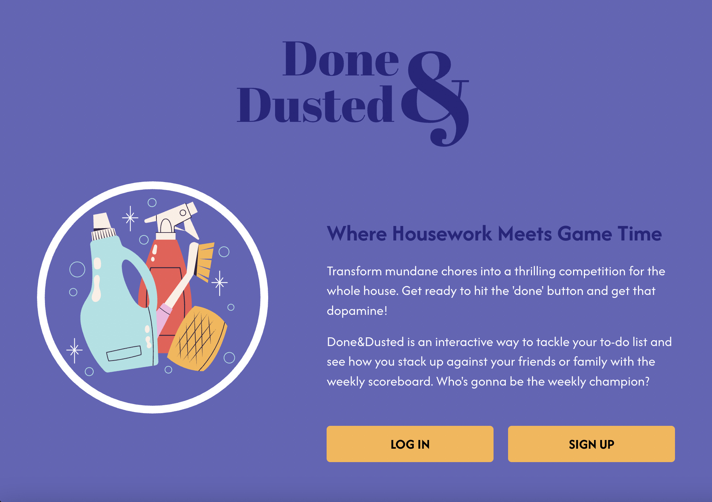
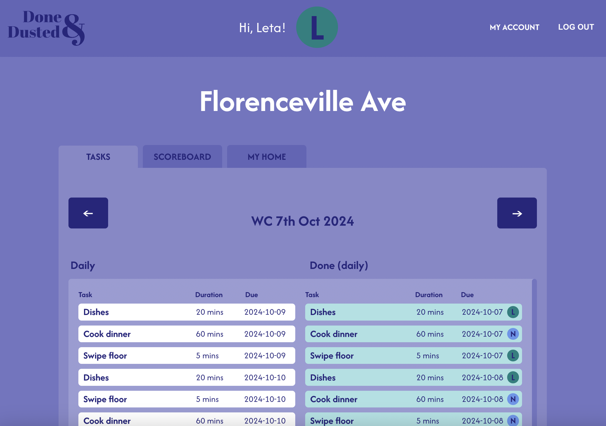
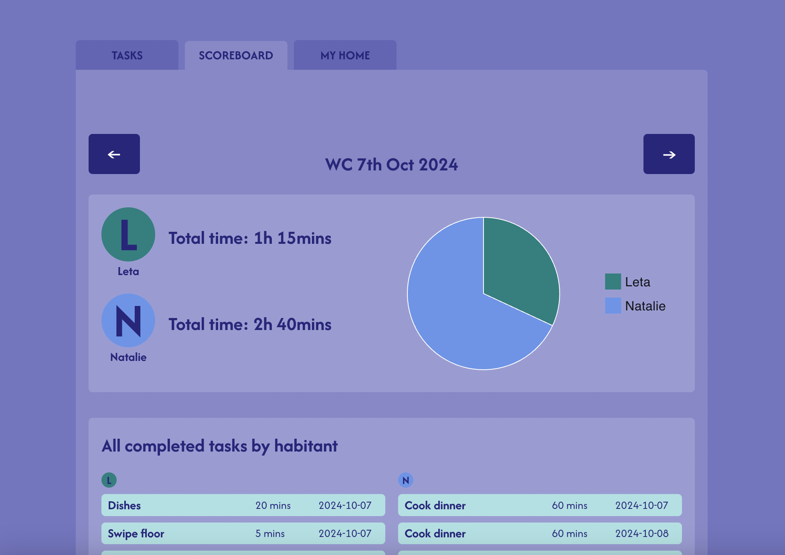

# Overview: Done & Dusted

A work in progress!

- This is the front-end part of the Done & Dusted project. It connects with the following back-end part: https://github.com/leta-krahenbuhl/done-and-dusted-server
- An app that turns housework into a competitive game!
- Check out the live site: https://done-and-dusted-production.up.railway.app/

### Tech Stack

- React front-end, Node.js/Express back-end connecting to a MongoDB Atlas database
- Authentication (sign up / log in with JWT tokens)
- CRUD operations
- Data visualisation with @mui/x-charts (npm library)
- Desktop only for now! To have a look at my responsive design skills check out mobile/tablet/desktop version of my portfolio: https://leta-krahenbuhl.co.uk/

### Features

- Home dashboard with task overview by week
- Weekly data visualisation with minutes of tasks completed by habitant
- Add or join/leave a home, add/edit/delete tasks

### APIs

API endpoints:

- api/singup
- api/login
- api/tasks
- api/users
- api/home

### Sitemap

#### /

- Landing page with task dashboard, stats, and overview of home
- Task dashboard displays taks sorted by repeat (daily/weekly/other)

#### /account

- User account overview
- Option to change icon colour or leave home

### Screenshots





### Data

- 1 non relational database (MongoDB Atlas)
- Three collections:
  - users
  - homes
  - tasks

### Endpoints

Rest to come...

<!-- #### BASE_URL/api/homes

- add a home

Request body

```
[
  {
    "_id": 1,
    "date": "11/13/2023, 3:30:00 PM",
    "title": "Gift Ideas",
  }
]
```

Response

```
[
  {
    "_id": 1,
    "date": "11/13/2023, 3:30:00 PM",
    "title": "Gift Ideas",
  }
]
```

#### http://localhost:8080/api/list-titles

- to get a list of all list titles, add a new list title, edit a list title or delete a list title
- GET / POST / PUT / DELETE

```
      {
        "id": 1,
        "date": "11/13/2023, 3:30:00 PM",
        "title": "Dad",
        "notebook_id": 1
      };
```

#### http://localhost:8080/api/list-items

- to get a list of all list items, add a new list items, edit a list items or delete a list items
- GET / POST / PUT / DELETE

```
      {
        "id": 1,
        "text": "Scarf",
        "done": false,
        "list_id": 1
      };
```

## Developer installation guide

- Download both client and server side of the notebooks code from GitHub:
  - Front-end: https://github.com/leta-krahenbuhl/notebooks
  - Back-end: https://github.com/leta-krahenbuhl/notebooks-server
- Log in to MySQL (mysql -u root -p, then type in your password and hit enter)
- Set up a local MySQL database called 'notebooks'
- Server side:
  - npm install (to install any dependencies including knex and mysql2)
  - set up a local .env file with your environment variables (see env.sample file for reference)
  - npx knex migrate:latest (create the three database tables)
  - npx knex seed:run (to populate the database tables)
  - npm start (to start server, should be as a custom script in package.json)
- Client side:
  - npm install (to install any dependencies)
  - set up a local .env file with your environment variables (see env.sample file for reference)
  - npm start (to view react app in browser)

## Key take-aways

- Coding takes time
- Error messages are my friends
- The same problem looks very different at 11:30pm and 11:30am
- If anything seems to complicated, break it down into several smaller problems -->
